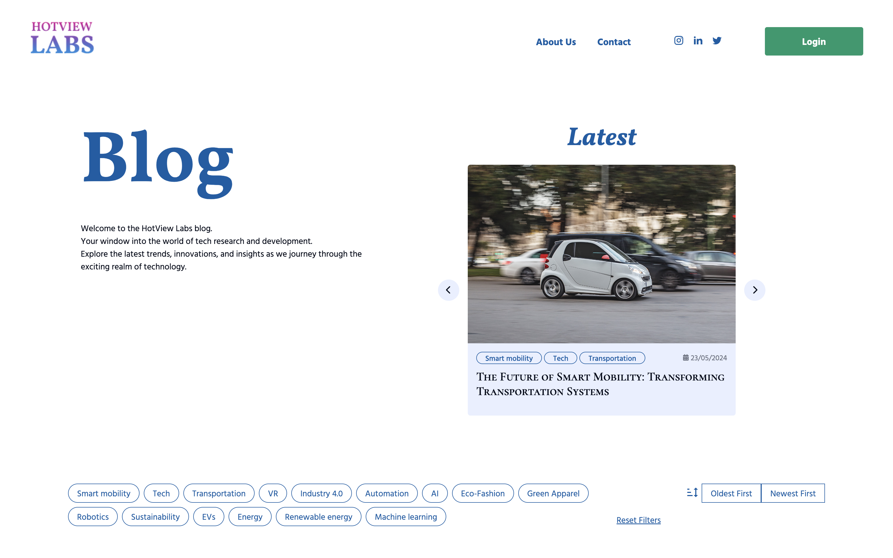

# FED1 Project Exam 1



[Visit the site](https://norofffeu.github.io/FED1-PE1-H-chai/)

## Description

This is a blog website for fictional client.

#### Client

- Name: HotView Labs
- Sector: Tech Research and Development
- Size: 30 employees
- Location: Worldwide
- Mission: Provide the most accurate and up to date insights to tech leaders across the world.

### Goal

- To apply the skills I have learned in the Front-end Development course at Noroff.
- To demonstrate my ability to interpret a brief, plan my solution, design a user interface, build and test a responsive web application.
- To use all of the skills that I have learned 1st year of the program including design, HTML, CSS and JavaScript.

### Brief

I have been hired to build a front-end user interface for an existing API blogging application. The client has asked for a responsive application that allows users to view dynamic blog posts. The client requires admin pages to register, login and manage their blog posts. During testing, I will use my own account that I create to act as the owner.

### User Stories

- As a user, I want to see an interactive banner carousel on the blog feed page, so that I can view a rotation of the 3 latest posts.
- As a user, I want to click on a button for each carousel item, taking me to the blog post page to read more.
- As a user, I want to click on the previous or next button in the carousel to animate and reveal another post, to ensure I can see different posts easily.
- As a user, I want the carousel to return to the first post after reaching the end of the list, and vice versa when clicking previous on the first post.
- As a user, I want to view a static list of the 12 latest posts in a responsive thumbnail grid on the blog feed page, so I can easily select which post to read.
- As a user, I want each thumbnail in the blog post feed to be clickable, taking me to the blog post page to read more.
- As a user, I want to see a responsive layout showing the post title, author, publication date, image banner, and post content from the API.
- As a user, I want each blog page to have a shareable URL including a query string or hash parameter that contains the post ID, so I can share the post with others easily.
- As the owner, I want the blog post edit page to be available only for me when logged in, to ensure no unauthorized edits can be made to my posts.
- As the owner, I want a delete button that sends a DELETE request to the API for this post ID on the edit page, so I can easily remove my post if needed.
- As the owner, I want a validated edit form that allows me to update the title, body content, or image by sending a PUT request to the API for this post ID, ensuring I can keep my posts up to date easily.
- As the owner, I want a validated login form that allows me to request and save a token to my browser by entering my email and password, allowing me to manage posts.
- As the owner, I want a validated register form that allows me to create a new account by entering my name, email and password.

## Built with

- Figma
- HTML
- CSS
- JavaScript

## Getting Started

1. Clone the repo:

```bash
git clone https://github.com/NoroffFEU/FED1-PE1-H-chai.git
```

2. Install the dependencies:

```
npm install
```

### Running

To run the app, run the following commands:

```bash
npm run start
```

## Contact

Feel free to contact me

[My LinkedIn Page](https://www.linkedin.com/in/hikari-%C3%B8verby-957493241)
